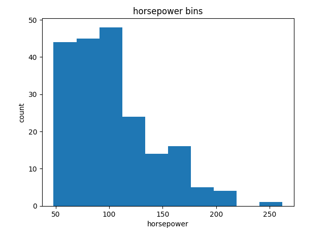
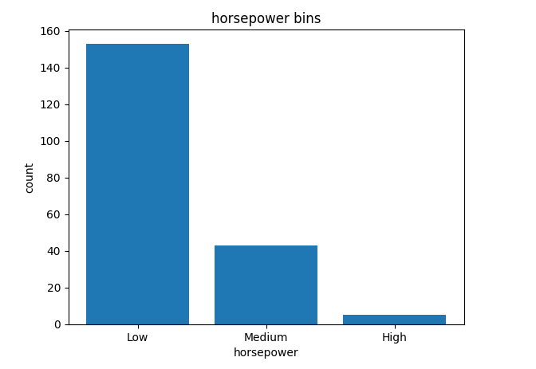
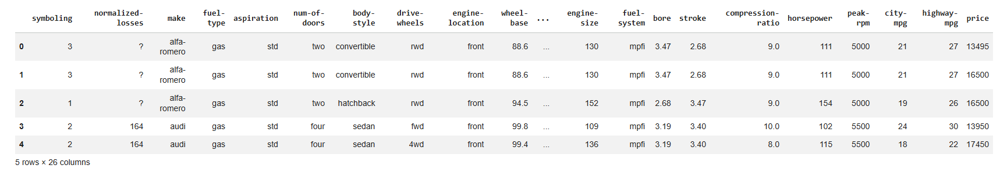
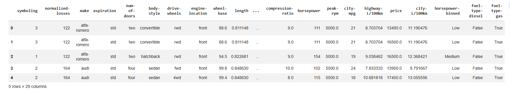

# data-wrangling-automobile-dataset
End-to-end data wrangling project using Python and pandas, including data cleaning, missing value handling, normalization, binning, and feature engineering on an automobile dataset.
# 🚗 Data Wrangling – Automobile Dataset

## Overview

This project demonstrates an end-to-end data wrangling workflow using Python and pandas on a real-world automobile dataset.

The objective was to clean, transform, and prepare raw data for analysis and machine learning by handling missing values, correcting data types, standardizing units, and engineering new features.

---

## Key Steps

### 1. Data Cleaning

* Replaced missing values (`?`) with `NaN`
* Imputed numerical columns using mean
* Imputed categorical columns using mode
* Removed rows with missing target values (`price`)

### 2. Data Transformation

* Converted incorrect data types to numeric
* Standardized fuel consumption:

  * MPG → L/100km
* Normalized features (`length`, `width`, `height`)

### 3. Feature Engineering

* Created binned categories for horsepower:

  * Low, Medium, High
* Generated indicator (dummy) variables for:

  * Fuel type
  * Aspiration

---

## Visualizations

### Horsepower Distribution

### Horsepower Binning

---

## Data Transformation

### Before Cleaning

### After Cleaning & Feature Engineering

---

## Technologies Used

* Python
* Pandas
* NumPy
* Matplotlib

---

## Key Takeaways

* Cleaned and transformed messy real-world data
* Applied feature engineering techniques
* Prepared dataset for machine learning workflows

---

## Why This Project Matters

Data wrangling is a critical step in any data pipeline. This project demonstrates the ability to:

* Handle missing and inconsistent data
* Normalize and standardize features
* Convert categorical variables into numerical formats
* Prepare data for analysis and modeling

---

## Dataset Source

UCI Machine Learning Repository – Automobile Dataset

---

## Author

Diane King
